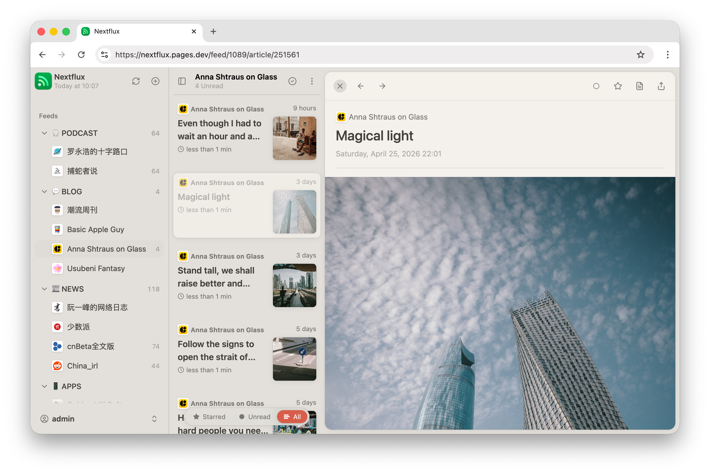
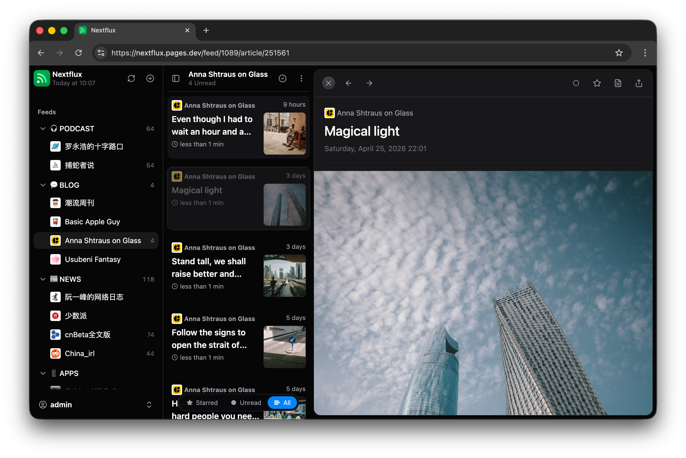
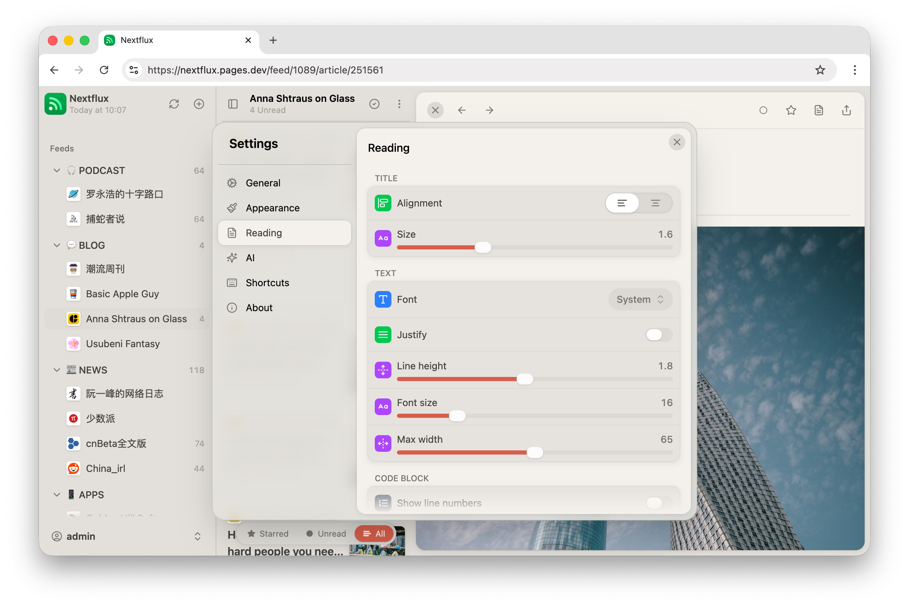
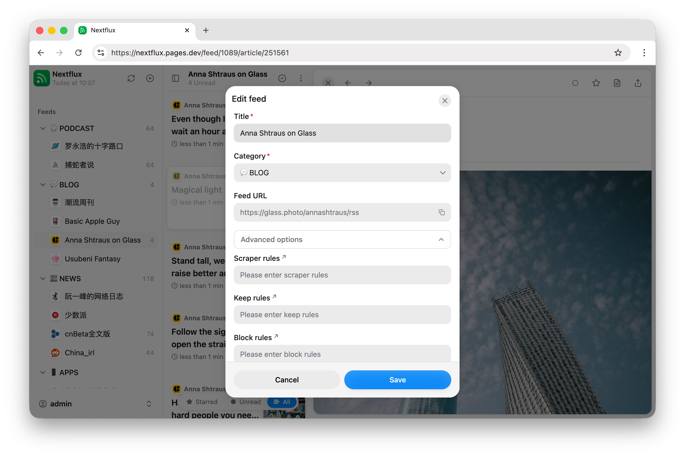

# Nextflux

A modern RSS reader client for [Miniflux](https://github.com/miniflux/v2) built with React + Vite.






## ✨ Features

- 🚀 Fast and responsive UI built with HeroUI (Previously NextUI)
- 🌐 Connect to your Miniflux server
- 🔄 Automatic background sync with configurable intervals
- 📱 Mobile-friendly with PWA support
- 🌙 Light/Dark mode with multiple theme options
- 🌍 i18n support (English & Chinese & Turkish & French)
- 👀 Mark as read on scroll
- 🎯 Rich reading experience
    - Custom font settings
    - Image gallery with touch gestures support
    - Save article to 3rd party services
- ⌨️ Keyboard shortcuts
- 📊 Feed management
    - OPML import
    - Category organization
    - Feed hiding
    - Feed discovery and search
    - Advanced options for feed management

## 🚀 Deployment

### Docker Deployment (standalone)

Run with Docker using the following command:

```bash
docker run -d --name nextflux -p 3000:3000 --restart unless-stopped electh/nextflux:latest
```

### Cloudflare Pages Deployment (standalone)

1. Fork this repository to your GitHub account
2. Create a new project in Cloudflare Pages
3. Select your forked repository
4. Select Framework preset: `React(Vite)`
5. Set build command: `npm run build`
6. Set build output directory: `dist`
7. Deploy and access through the Cloudflare-assigned domain

### Docker Compose Deployment (with Miniflux)

To deploy with Miniflux, copy [docker compose file](./compose.yml) and replace the passwords, then run:

```bash
docker compose up -d
```

## 📝 Configuration

The app requires a Miniflux server to function. You'll need to provide:

- Server URL
- API Token / Username and Password

## 🌍 Browser Support

- Chrome (recommended)
- Firefox
- Safari
- Edge

## 📱 Mobile Support

The app is primarily designed for desktop use. While it works on mobile devices, a native RSS reader app will provide a much better experience on the go.

> 💡 **Tip**: For a better native experience on mobile, consider using dedicated RSS reader apps like [Reeder](https://reederapp.com/), [Unread](https://www.goldenhillsoftware.com/unread/) or [Capy Reader](https://capyreader.com/).

## 🤝 Contributing

Contributions are welcome! Please feel free to submit a Pull Request.

## 📄 License

Do whatever the heck you want with it—just don’t come crying to me if it messes up your stuff. Just kidding (or not),
but seriously, it’s all yours.

## 📚 FAQ

### 1. My scrollbar looks like shit in Windows—how do I fix this?

If you’re using Microsoft Edge, head over to the `edge://flags` page and enable the `Fluent overlay scrollbars` option.
Chrome might have something similar lurking around.

### 2. Are there any plans to support Fever or Google Reader APIs?

Nope, sorry folks. For now, I’m all in on the Miniflux API—gotta pick my battles.

### 3. Why does it resemble Reeder so much?

Reeder is a fantastic RSS reader. Since my design skills are about as good as a potato's, I took some "inspiration" from
its UI style, slapped it on, and called it a day.

## 🌍 Translation

### Contributor

- 🇹🇷 Turkish: [@TaylanTatli](https://github.com/TaylanTatli)

- 🇫🇷 French: [@quent1-fr](https://github.com/quent1-fr)


